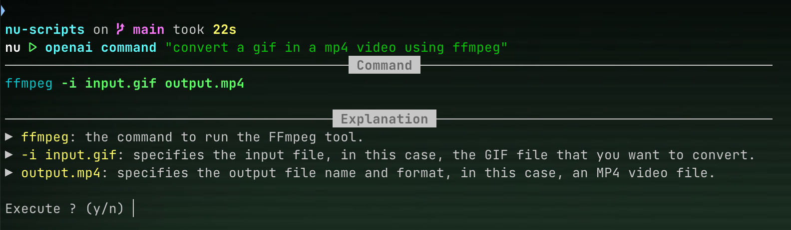

# Nu scripts

This is a collection of scripts I use to make my life easier in [nu](https://nushell.sh).

## OpenAI script

This script uses the [OpenAI API](https://platform.openai.com/) to generate text. 
There are api commands and some prompt commands to make it easier to use.



### Usage

Execute this line in nu :

```nu
use /path/to/scripts/openai.nu
```

### API Commands
```nu
openai api models [--model <model>]
```
Lists the OpenAI models. If model is specified, it will return the details of that model.

**Parameters :**

- **model (string)**: ID of the model to to get detail.

---
```nu
openai api completion <model> [--prompt <prompt>] [--suffix <suffix>] [--max_tokens <max_tokens>] [--temperature <temperature>] [--top_p <top_p>] [--n <n>] [--logprobs <logprobs>] [--echo <echo>] [--stop <stop>] [--frequency_penalty <frequency_penalty>] [--presence_penalty <presence_penalty>] [--best-of <best_of>] [--logit_bias <logit_bias>] [--user <user>]
```
Completion API call. 
See [OpenAI docs](https://platform.openai.com/docs/api-reference/completions/create) for more info.

**Parameters :**

- **model (string)**: ID of the model to use.
- **--prompt (string)**: The prompt(s) to generate completions for
- **--suffix (string)**: The suffix that comes after a completion of inserted text.
- **--max-tokens (int)**: The maximum number of tokens to generate in the completion.
- **--temperature (number)**: The temperature used to control the randomness of the completion.
- **--top-p (number)**: The top-p used to control the randomness of the completion.
- **--n (int)**: How many completions to generate for each prompt. Use carefully, as it's a token eater.
- **--logprobs (int)**: Include the log probabilities on the logprobs most likely tokens, as well the chosen tokens.
- **--echo (bool)**: Include the prompt in the returned text.
- **--stop (any)**: A list of tokens that, if encountered, will stop the completion.
- **--frequency-penalty (number)**: A penalty to apply to each token that appears more than once in the completion.
- **--presence-penalty (number)**: A penalty to apply if the specified tokens don't appear in the completion.
- **--best-of (int)**: Generates best_of completions server-side and returns the "best" (the one with the highest log probability per token). Use carefully, as it's a token eater.
- **--logit-bias (record)**: A record to modify the likelihood of specified tokens appearing in the completion
- **--user (string)**: A unique identifier representing your end-user.

---
```nu
openai api chat-completion <model> <messages> [--max_tokens <max_tokens>] [--temperature <temperature>] [--top_p <top_p>] [--n <n>] [--stop <stop>] [--frequency_penalty <frequency_penalty>] [--presence_penalty <presence_penalty>] [--logit_bias <logit_bias>] [--user <user>]
```

Chat completion API call. 
See [OpenAI docs](https://platform.openai.com/docs/api-reference/chat/create) for more info.

**Parameters :**

- **model (string)**: ID of the model to use.
- **messages (list)**: List of messages to complete from.
- **--max-tokens (int)**: The maximum number of tokens to generate in the completion.
- **--temperature (number)**: The temperature used to control the randomness of the completion.
- **--top-p (number)**: The top-p used to control the randomness of the completion.
- **--n (int)**: How many completions to generate for each prompt. Use carefully, as it's a token eater.
- **--stop (any)**: A list of tokens that, if encountered, will stop the completion.
- **--frequency-penalty (number)**: A penalty to apply to each token that appears more than once in the completion.
- **--presence-penalty (number)**: A penalty to apply if the specified tokens don't appear in the completion.
- **--logit-bias (record)**: A record to modify the likelihood of specified tokens appearing in the completion
- **--user (string)**: A unique identifier representing your end-user.

### Prompt Commands

```nu
openai command [input] [--max_tokens <max_tokens>] [--no-interactive]
```
Ask for a one line command(s) to run. 

In interactive mode, `openai command` will ask you if you want to run the line. Otherwise, in non interactiuve mode,
it will return the line in the pipeline.

`openai command` uses chat-completion with "gpt-3.5-turbo" model.

**Parameters :**

- **input (string)**: Your prompt. If `input` is not specified, `openai command` will take the prompt from the pipeline
input 
- **--max-tokens (int)**: The maximum number of tokens to generate in the completion, defaults to 200
- **--no-interactive (flag)**: If true, will not ask to execute and will pipe the result.

---
```nu
openai ask [input] [--model <model>] [--max_tokens <max_tokens>] [--no-interactive]
```
Ask any question to the OpenAI model. 

It works like you ask a question or anything to ChatGPT. See `openai chat` to continue a conversation.

**Parameters :**

- **input (string)**: Your prompt. If `input` is not specified, `openai chat` will take the prompt from the pipeline
input 
- **--model(-m)(string)**: ID of the model to use. Put a model compatible with chat-completion. Default to "gpt-3.5-turbo"
- **--max-tokens (int)**: The maximum number of tokens to generate in the completion, defaults to 300
- **--no-interactive (flag)**: Disable interactive mode

---
```nu
openai chat [input] [--model <model>] [--max_tokens <max_tokens>] [--reset]
```
Continue a conversation based on the previous [Prompt commands](#prompt-commands). 

It's similar to ChatGPT. You write a prompt 

If `reset` is specified, it will remove the history of messages to start on a new basis.

**Parameters :**

- **input (string)**: Your prompt. If `input` is not specified, `openai command` will take the prompt from the pipeline
input 
- **--model(-m)(string)**: ID of the model to use. Put a model compatible with chat-completion. Default to "gpt-3.5-turbo"
- **--max-tokens (int)**: The maximum number of tokens to generate in the completion, defaults to 300
- **--reset(-r) (int)**: Resets the history

---
```nu
openai chat list [--system] [--raw]
```
Lists all messages in the chat history

System messages are included only if `system` is specified.

If `raw` is specified, the command returns the message list data.

**Parameters :**

- **--system(-s) (flag)**: Include system messages
- **--raw(-r) (flag)**: Return raw message data

---
```nu
openai git diff  [--model <model>] [--max_tokens <max_tokens>] [--no-interactive]
```
Generate a commit message based on the staged change of the current directory

The command suggests to send the commit for you if `no-interactive` is not specified.

**Parameters :**

- **--model(-m)(string)**: ID of the model to use. Put a model compatible with chat-completion. Default to "gpt-3.5-turbo"
- **--max-tokens (int)**: The maximum number of tokens to generate in the completion, defaults to 20
- **--no-interactive (flag)**: Disable interactive mode